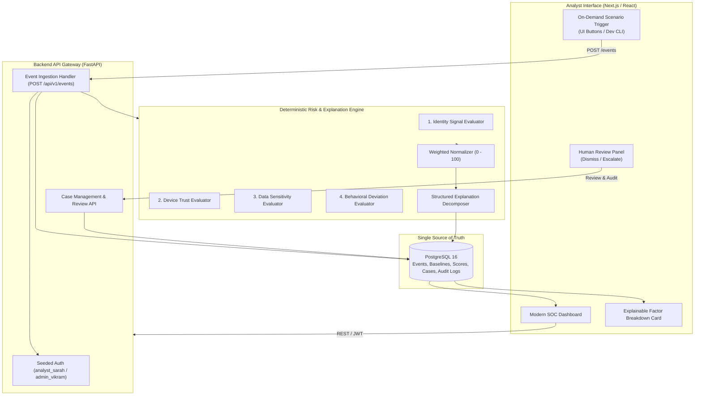

# NIRIKSHAK Architecture Specification (Trimmed 7-Day MVP)

> **NIRIKSHAK**: Contextual, Human-Supervised, Explainable Risk and Access Knowledge Framework  
> **Architecture Scope**: Solo Demo Build (Fast, Reliable, Demonstrable)  
> **Status**: APPROVED REVISED MVP ARCHITECTURE

---

## 1. System Role & Core Axiom

NIRIKSHAK is a defensive cybersecurity and insider-risk decision support platform. Its primary objective is:

> To continuously evaluate whether access to sensitive information remains contextually reasonable, even when the user is technically authenticated and authorized.

### The Foundational Axiom
$$\text{Unusual Activity} \neq \text{Confirmed Malicious Activity}$$

* NIRIKSHAK is a **Decision Support System**, not an autonomous punishment or accusation engine.
* The system evaluates access attempts against contextual baselines, calculates explainable risk scores, and routes high-risk events to human security analysts for triage.

---

## 2. Trimmed MVP System Architecture

To ensure flawless reliability and execution within a ~7-day solo development cycle, the architecture is intentionally streamlined. PostgreSQL acts as the single source of truth for all persistence, caching, and querying. Redis, OpenSearch, ML Isolation Forest, correlation sliding windows, and the terminal console are removed from this build.

---

## 3. Four Deterministic Risk Signals

The risk engine uses a transparent, additive, rules-based model with configurable weights ($w_I = w_D = w_S = w_B = 0.25$, $\sum w_i = 1.0$):

$$\text{Final Risk} = w_I \cdot S_{\text{Identity}} + w_D \cdot S_{\text{Device}} + w_S \cdot S_{\text{Sensitivity}} + w_B \cdot S_{\text{Behavior}}$$

Every sub-score is normalized to $[0, 100]$, ensuring the final score remains strictly bounded within $[0, 100]$.

### 1. Identity Signal ($S_{\text{Identity}}$)
* Evaluates authentication freshness, MFA verification, and account status.
* Rule examples:
  * MFA active: $0$
  * Missing MFA on sensitive access: $+50$
  * Account flagged/probationary: $+40$

### 2. Device Trust Signal ($S_{\text{Device}}$)
* Evaluates whether the accessing endpoint is recognized, corporate-enrolled, and healthy.
* Rule examples:
  * Registered corporate laptop: $0$
  * Unregistered / unknown device: $+60$
  * Suspicious non-corporate IP locality: $+30$

### 3. Data Sensitivity Signal ($S_{\text{Sensitivity}}$)
* Evaluates data tier and departmental ownership boundaries.
* Rule examples:
  * `PUBLIC` ($10$), `INTERNAL` ($25$), `CONFIDENTIAL` ($50$), `RESTRICTED` ($75$), `CRITICAL` ($90$).
  * Cross-department deviation (e.g. Finance user accessing Defense R&D repo): $+20$.

### 4. Behavioral Deviation Signal ($S_{\text{Behavior}}$)
* Compares current event against the user's pre-computed historical baseline:
  * Access time outside normal working hours: $+40$.
  * Transferred volume exceeds baseline mean by $> 3\sigma$: $+45$.
  * Resource accessed for the first time by this user: $+25$.

---

## 4. Risk Tiers & Human Review Action

| Score Range | Tier | System Behavior |
| :---: | :--- | :--- |
| **0 – 30** | **LOW** | Normal activity. Logged to PostgreSQL for monitoring. |
| **31 – 60** | **MODERATE** | Contextual anomaly. Flagged on dashboard for review. |
| **61 – 80** | **HIGH** | Elevated risk. Automatically creates a `SecurityCase`. |
| **81 – 100**| **CRITICAL** | Severe risk. High-priority case requiring analyst review. |

### The Human-in-the-Loop Workflow
For each security case, the analyst has **one straightforward operational decision**:
* **DISMISS**: Mark event as benign contextual variance (requires reason).
* **ESCALATE**: Mark event for security follow-up or credential review (requires reason).
* **Audit Guarantee**: Every action writes an immutable record to the `audit_logs` table (`actor_id`, `action`, `case_id`, `justification`, `timestamp`).

---

## 5. Synthetic Telemetry & On-Demand Demo Scenarios

Rather than an uncontrollable background stream, NIRIKSHAK provides a controlled **On-Demand Scenario Trigger** (both via UI buttons and CLI script `python -m simulator.event_generator --scenario <name>`):
1. **Scenario 1 (Normal Day)**: `USER-001` accesses `Engineering Repository B` from registered laptop during normal work hours (Risk: LOW, ~15).
2. **Scenario 2 (Off-Hours Exploration)**: `USER-002` accesses `Operational Repository A` at 02:30 AM without MFA (Risk: HIGH, ~74).
3. **Scenario 3 (Exfiltration Attempt)**: `USER-003` downloads 2.5 GB from `Personnel Security Repository D` using an unregistered personal device (Risk: CRITICAL, ~88).

---

## 6. Frontend Dashboard Experience

Built with Next.js 14, React 18, Tailwind CSS, and Recharts:
* **Event Stream Table**: Real-time list of ingested events with colored risk badges (`LOW`, `MODERATE`, `HIGH`, `CRITICAL`).
* **Explainable Factor Breakdown**: Clicking any event shows the exact mathematical point breakdown and plain-language explanation of why it was flagged.
* **Case Triage Panel**: One-click **Dismiss** and **Escalate** buttons with mandatory justification input.
* **On-Demand Scenario Panel**: Interactive buttons to inject pre-scripted demo events instantly during live demonstrations.
