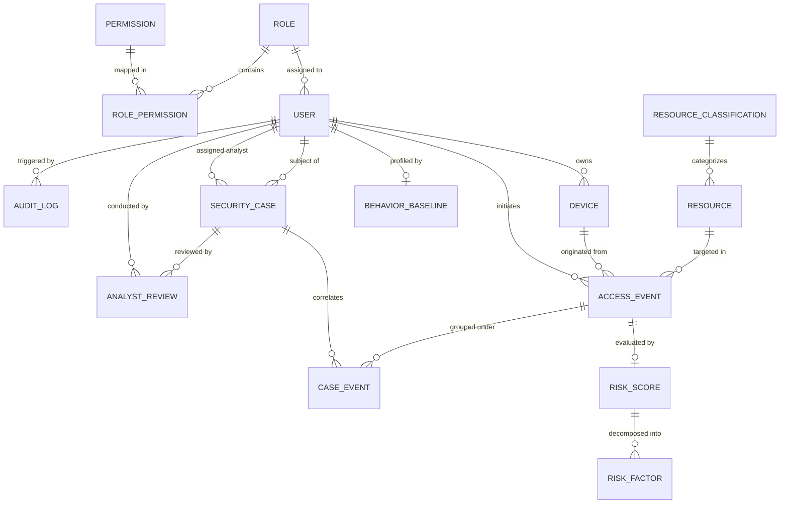

# NIRIKSHAK Database Design & Schema Specification

> **NIRIKSHAK**: Contextual, Human-Supervised, Explainable Risk and Access Knowledge Framework  
> **Database Engine**: PostgreSQL 16  
> **Status**: APPROVED SCHEMA DRAFT

---

## 1. Relational Entity Relationship Diagram (ERD)



---

## 2. Comprehensive Entity Definitions

All tables use `UUID` primary keys generated by `gen_random_uuid()` (or `uuid_generate_v4()`), store all timestamps in UTC (`TIMESTAMPTZ`), and enforce strict foreign key constraints.

---

### 2.1. Access Control & Identity

#### Table: `roles`
Defines RBAC authorization levels for NIRIKSHAK operators and simulated users.
| Column | Type | Constraints | Description |
| :--- | :--- | :--- | :--- |
| `id` | UUID | PK, DEFAULT `gen_random_uuid()` | Unique role ID |
| `name` | VARCHAR(50) | NOT NULL, UNIQUE | Role name (e.g., `ANALYST_TIER_1`, `ADMIN`) |
| `description` | VARCHAR(255) | NULL | Purpose and responsibilities |
| `created_at` | TIMESTAMPTZ | NOT NULL, DEFAULT `NOW()` | Creation timestamp (UTC) |

#### Table: `permissions`
Granular actions within the NIRIKSHAK system.
| Column | Type | Constraints | Description |
| :--- | :--- | :--- | :--- |
| `id` | UUID | PK, DEFAULT `gen_random_uuid()` | Unique permission ID |
| `code` | VARCHAR(100) | NOT NULL, UNIQUE | Permission code (e.g., `events:read`, `cases:review`) |
| `description` | VARCHAR(255) | NULL | Description of permitted action |

#### Table: `role_permissions`
Join table mapping roles to permissions.
| Column | Type | Constraints | Description |
| :--- | :--- | :--- | :--- |
| `role_id` | UUID | PK, FK `roles(id)` ON DELETE CASCADE | Target role |
| `permission_id` | UUID | PK, FK `permissions(id)` ON DELETE CASCADE | Granted permission |

#### Table: `users`
Represents synthetic actors and security analysts. Implements strict data minimization.
| Column | Type | Constraints | Description |
| :--- | :--- | :--- | :--- |
| `id` | UUID | PK, DEFAULT `gen_random_uuid()` | Internal unique user ID |
| `external_identifier` | VARCHAR(50) | NOT NULL, UNIQUE | Public/pseudonymous identifier (e.g. `USER-104`) |
| `username` | VARCHAR(100) | NOT NULL, UNIQUE | Login handle / analyst username |
| `hashed_password` | VARCHAR(255) | NOT NULL | Salted modern password hash |
| `role_id` | UUID | NOT NULL, FK `roles(id)` | User's assigned RBAC role |
| `department` | VARCHAR(100) | NOT NULL | Department (e.g. `ENGINEERING`, `SECURITY`) |
| `status` | VARCHAR(20) | NOT NULL, DEFAULT `'ACTIVE'` | `ACTIVE`, `SUSPENDED`, `INACTIVE` |
| `created_at` | TIMESTAMPTZ | NOT NULL, DEFAULT `NOW()` | Record creation timestamp |
| `updated_at` | TIMESTAMPTZ | NOT NULL, DEFAULT `NOW()` | Last update timestamp |

---

### 2.2. Infrastructure & Resources

#### Table: `devices`
Tracks synthetic client devices and their assessed trust postures.
| Column | Type | Constraints | Description |
| :--- | :--- | :--- | :--- |
| `id` | UUID | PK, DEFAULT `gen_random_uuid()` | Internal unique device ID |
| `device_identifier` | VARCHAR(100) | NOT NULL, UNIQUE | Synthetic device UUID/hardware ID |
| `owner_user_id` | UUID | NULL, FK `users(id)` | Registered owner (if assigned) |
| `device_type` | VARCHAR(50) | NOT NULL | `WORKSTATION`, `LAPTOP`, `MOBILE`, `SERVER` |
| `registered` | BOOLEAN | NOT NULL, DEFAULT FALSE | Whether device is officially corporate-enrolled |
| `trust_level` | VARCHAR(20) | NOT NULL, DEFAULT `'UNKNOWN'` | `TRUSTED`, `MODERATE`, `LOW`, `UNKNOWN`, `REVOKED` |
| `first_seen` | TIMESTAMPTZ | NOT NULL, DEFAULT `NOW()` | First recorded access timestamp |
| `last_seen` | TIMESTAMPTZ | NOT NULL, DEFAULT `NOW()` | Most recent access timestamp |
| `status` | VARCHAR(20) | NOT NULL, DEFAULT `'ACTIVE'` | `ACTIVE`, `DECOMMISSIONED`, `QUARANTINED` |

#### Table: `resource_classifications`
Data classification schema defining information sensitivity tiers.
| Column | Type | Constraints | Description |
| :--- | :--- | :--- | :--- |
| `id` | UUID | PK, DEFAULT `gen_random_uuid()` | Unique classification ID |
| `level` | VARCHAR(50) | NOT NULL, UNIQUE | `PUBLIC`, `INTERNAL`, `CONFIDENTIAL`, `RESTRICTED`, `CRITICAL` |
| `base_sensitivity_score` | INTEGER | NOT NULL | Baseline sensitivity risk multiplier (10 to 100) |
| `description` | VARCHAR(255) | NULL | Handling rules and protection requirements |

#### Table: `resources`
Assets and synthetic repositories evaluated during access attempts.
| Column | Type | Constraints | Description |
| :--- | :--- | :--- | :--- |
| `id` | UUID | PK, DEFAULT `gen_random_uuid()` | Internal unique resource ID |
| `name` | VARCHAR(150) | NOT NULL | Resource name (e.g. `Operational Repository A`) |
| `category` | VARCHAR(50) | NOT NULL | `SOURCE_CODE`, `FINANCIAL_LEDGER`, `PERSONNEL_DB` |
| `classification_id` | UUID | NOT NULL, FK `resource_classifications(id)` | Data sensitivity tier |
| `owner_department` | VARCHAR(100) | NOT NULL | Owning department (e.g. `DEFENSE_RD`) |
| `active` | BOOLEAN | NOT NULL, DEFAULT TRUE | Availability status |
| `created_at` | TIMESTAMPTZ | NOT NULL, DEFAULT `NOW()` | Creation timestamp |

---

### 2.3. Telemetry & Behavioral Baselines

#### Table: `access_events`
The foundational telemetry entity. Highly indexed and structured for analytical queries.
| Column | Type | Constraints | Description |
| :--- | :--- | :--- | :--- |
| `id` | UUID | PK, DEFAULT `gen_random_uuid()` | Internal event database key |
| `event_id` | VARCHAR(100) | NOT NULL, UNIQUE | External client event identifier (e.g. `evt_001`) |
| `timestamp` | TIMESTAMPTZ | NOT NULL | Exact event occurrence time (UTC) |
| `user_id` | UUID | NOT NULL, FK `users(id)` | Actor requesting access |
| `device_id` | UUID | NOT NULL, FK `devices(id)` | Device initiating access |
| `resource_id` | UUID | NOT NULL, FK `resources(id)` | Target resource |
| `session_id` | VARCHAR(100) | NOT NULL | Correlation session ID |
| `action` | VARCHAR(50) | NOT NULL | `READ`, `WRITE`, `EXPORT`, `DELETE`, `EXECUTE` |
| `result` | VARCHAR(20) | NOT NULL | `SUCCESS`, `DENIED`, `CHALLENGED` |
| `data_volume` | BIGINT | NOT NULL, DEFAULT 0 | Bytes transferred in operation |
| `source_context` | JSONB | NOT NULL, DEFAULT `'{}'` | Context (e.g. `{"ip": "10.0.4.12", "mfa": true}`) |
| `created_at` | TIMESTAMPTZ | NOT NULL, DEFAULT `NOW()` | Ingestion timestamp |

#### Table: `behavior_baselines`
Statistical behavioral model established per synthetic user profile.
| Column | Type | Constraints | Description |
| :--- | :--- | :--- | :--- |
| `id` | UUID | PK, DEFAULT `gen_random_uuid()` | Baseline record ID |
| `user_id` | UUID | NOT NULL, UNIQUE, FK `users(id)` | Target user |
| `typical_hours` | JSONB | NOT NULL | Working hour distribution (e.g. `{"start": 8, "end": 18}`) |
| `typical_devices` | JSONB | NOT NULL | Array of frequently used device IDs |
| `typical_resources` | JSONB | NOT NULL | Array of regular resource categories / IDs |
| `avg_daily_volume` | BIGINT | NOT NULL, DEFAULT 0 | Historical average bytes transferred daily ($\mu$) |
| `std_daily_volume` | BIGINT | NOT NULL, DEFAULT 0 | Historical volume standard deviation ($\sigma$) |
| `baseline_updated_at` | TIMESTAMPTZ | NOT NULL, DEFAULT `NOW()` | Last recalculation timestamp |

---

### 2.4. Risk Scoring & Explainability

#### Table: `risk_scores`
Deterministic and ML-augmented composite risk scores computed per event.
| Column | Type | Constraints | Description |
| :--- | :--- | :--- | :--- |
| `id` | UUID | PK, DEFAULT `gen_random_uuid()` | Risk evaluation record ID |
| `event_id` | UUID | NOT NULL, UNIQUE, FK `access_events(id)` | Evaluated access event |
| `total_score` | NUMERIC(5,2) | NOT NULL | Composite normalized score ($0.00$ to $100.00$) |
| `risk_level` | VARCHAR(20) | NOT NULL | `LOW`, `MODERATE`, `HIGH`, `CRITICAL` |
| `identity_score` | NUMERIC(5,2) | NOT NULL | Layer 1 Identity risk contribution |
| `device_score` | NUMERIC(5,2) | NOT NULL | Layer 2 Device trust risk contribution |
| `sensitivity_score` | NUMERIC(5,2) | NOT NULL | Layer 3 Resource sensitivity contribution |
| `behavior_score` | NUMERIC(5,2) | NOT NULL | Layer 4 Behavioral deviation contribution |
| `anomaly_score` | NUMERIC(5,2) | NOT NULL | Layer 5 ML Isolation Forest contribution |
| `correlation_score`| NUMERIC(5,2) | NOT NULL | Layer 6 Multi-event sequence amplification |
| `created_at` | TIMESTAMPTZ | NOT NULL, DEFAULT `NOW()` | Computation timestamp |

#### Table: `risk_factors`
Fine-grained explainability factors contributing to the `risk_scores`.
| Column | Type | Constraints | Description |
| :--- | :--- | :--- | :--- |
| `id` | UUID | PK, DEFAULT `gen_random_uuid()` | Factor record ID |
| `risk_score_id` | UUID | NOT NULL, FK `risk_scores(id)` ON DELETE CASCADE | Parent risk score |
| `factor` | VARCHAR(100) | NOT NULL | Identifier (e.g. `OFF_HOURS_ACCESS`, `UNFAMILIAR_DEVICE`) |
| `contribution` | NUMERIC(5,2) | NOT NULL | Quantified score contribution points |
| `details` | JSONB | NOT NULL, DEFAULT `'{}'` | Human-readable explanation and telemetry context |

---

### 2.5. Security Cases, Reviews & Audit Trails

#### Table: `security_cases`
Incidents requiring human security analyst review.
| Column | Type | Constraints | Description |
| :--- | :--- | :--- | :--- |
| `id` | UUID | PK, DEFAULT `gen_random_uuid()` | Internal case ID |
| `case_identifier` | VARCHAR(50) | NOT NULL, UNIQUE | Analyst-facing ID (e.g. `CASE-2026-0041`) |
| `status` | VARCHAR(30) | NOT NULL, DEFAULT `'OPEN'` | `OPEN`, `UNDER_REVIEW`, `MONITORING`, `ESCALATED`, `RESOLVED`, `DISMISSED` |
| `severity` | VARCHAR(20) | NOT NULL | `LOW`, `MODERATE`, `HIGH`, `CRITICAL` |
| `primary_user_id` | UUID | NOT NULL, FK `users(id)` | Subject user of the investigation |
| `opened_at` | TIMESTAMPTZ | NOT NULL, DEFAULT `NOW()` | Creation time |
| `updated_at` | TIMESTAMPTZ | NOT NULL, DEFAULT `NOW()` | Last modification time |
| `assigned_analyst_id`| UUID | NULL, FK `users(id)` | Assigned security investigator |

#### Table: `case_events`
Associates correlated access events with a security case.
| Column | Type | Constraints | Description |
| :--- | :--- | :--- | :--- |
| `id` | UUID | PK, DEFAULT `gen_random_uuid()` | Join record ID |
| `case_id` | UUID | NOT NULL, FK `security_cases(id)` ON DELETE CASCADE | Target case |
| `event_id` | UUID | NOT NULL, FK `access_events(id)` | Correlated event |
| `correlation_reason`| VARCHAR(255) | NOT NULL | Reason grouped (e.g. `RAPID_RESOURCE_TRAVERSAL`) |
| `added_at` | TIMESTAMPTZ | NOT NULL, DEFAULT `NOW()` | Association timestamp |

#### Table: `analyst_reviews`
Immutable record of human determinations on security cases.
| Column | Type | Constraints | Description |
| :--- | :--- | :--- | :--- |
| `id` | UUID | PK, DEFAULT `gen_random_uuid()` | Review record ID |
| `case_id` | UUID | NOT NULL, FK `security_cases(id)` | Reviewed case |
| `analyst_id` | UUID | NOT NULL, FK `users(id)` | Analyst submitting review |
| `action` | VARCHAR(50) | NOT NULL | `DISMISS`, `MONITOR`, `REQUEST_VERIFICATION`, `ESCALATE`, `RESOLVE` |
| `justification` | TEXT | NOT NULL | Mandatory human explanation for decision |
| `review_timestamp`| TIMESTAMPTZ | NOT NULL, DEFAULT `NOW()` | Exact review time |

#### Table: `audit_logs`
System-wide append-only tamper-evident audit record.
| Column | Type | Constraints | Description |
| :--- | :--- | :--- | :--- |
| `id` | UUID | PK, DEFAULT `gen_random_uuid()` | Log entry ID |
| `timestamp` | TIMESTAMPTZ | NOT NULL, DEFAULT `NOW()` | Audit event time (UTC) |
| `actor_id` | UUID | NULL, FK `users(id)` | Operator or service account initiating action |
| `actor_type` | VARCHAR(50) | NOT NULL | `USER`, `ANALYST`, `SYSTEM_SERVICE`, `SIMULATOR` |
| `action` | VARCHAR(100) | NOT NULL | Executed operation (e.g. `policy:update`, `case:dismiss`) |
| `target_entity` | VARCHAR(50) | NOT NULL | Affected entity table (`policies`, `security_cases`) |
| `target_id` | VARCHAR(100) | NULL | Affected record identifier |
| `details` | JSONB | NOT NULL, DEFAULT `'{}'` | Snapshot of changes / parameters |
| `ip_address` | VARCHAR(45) | NULL | Originating IP address |

#### Table: `policies`
Configurable weights and threshold parameters.
| Column | Type | Constraints | Description |
| :--- | :--- | :--- | :--- |
| `id` | UUID | PK, DEFAULT `gen_random_uuid()` | Policy entry ID |
| `policy_key` | VARCHAR(100) | NOT NULL, UNIQUE | Config key (e.g. `WEIGHT_BEHAVIOR`) |
| `weight_value` | NUMERIC(5,4) | NOT NULL | Floating multiplier ($0.0000$ to $1.0000$) |
| `rules_json` | JSONB | NOT NULL, DEFAULT `'{}'` | Detailed threshold or rules definition |
| `updated_at` | TIMESTAMPTZ | NOT NULL, DEFAULT `NOW()` | Modification time |
| `updated_by` | UUID | NULL, FK `users(id)` | Admin user modifying the policy |

---

## 3. Database Indexes & Performance Optimization

```sql
-- High-throughput telemetry and sliding-window lookups
CREATE INDEX idx_access_events_user_time ON access_events (user_id, timestamp DESC);
CREATE INDEX idx_access_events_device_time ON access_events (device_id, timestamp DESC);
CREATE INDEX idx_access_events_session ON access_events (session_id);
CREATE INDEX idx_access_events_timestamp ON access_events (timestamp DESC);

-- Risk score lookups
CREATE INDEX idx_risk_scores_event ON risk_scores (event_id);
CREATE INDEX idx_risk_scores_level ON risk_scores (risk_level, total_score DESC);

-- Case management queries
CREATE INDEX idx_security_cases_status_severity ON security_cases (status, severity);
CREATE INDEX idx_security_cases_user ON security_cases (primary_user_id);
CREATE INDEX idx_security_cases_analyst ON security_cases (assigned_analyst_id);

-- GIN indexes for JSONB search
CREATE INDEX idx_access_events_source_context ON access_events USING gin (source_context);
CREATE INDEX idx_risk_factors_details ON risk_factors USING gin (details);
CREATE INDEX idx_audit_logs_details ON audit_logs USING gin (details);
```
