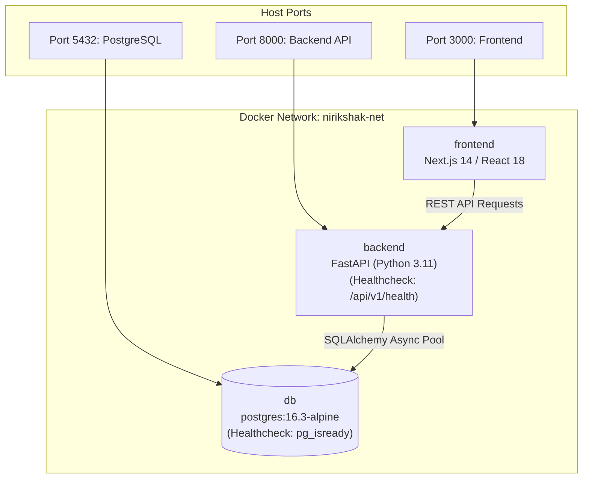

# NIRIKSHAK Docker & Service Plan (Trimmed 7-Day MVP)

> **NIRIKSHAK**: Contextual, Human-Supervised, Explainable Risk and Access Knowledge Framework  
> **Topology**: 3 Services (Database, Backend API, Frontend Dashboard)  
> **Status**: APPROVED REVISED MVP SERVICE PLAN

---

## 1. Container Topology Overview



---

## 2. Service Specifications

### 2.1. `db` (PostgreSQL 16)
* **Image**: `postgres:16.3-alpine`
* **Host Port**: `5432` | **Internal Port**: `5432`
* **Volumes**: `postgres_data:/var/lib/postgresql/data`
* **Healthcheck**: `pg_isready -U $$POSTGRES_USER -d $$POSTGRES_DB`
* **Role**: Single source of truth for users, devices, resources, baselines, access events, risk evaluations, cases, and audit logs.

### 2.2. `backend` (FastAPI Application Server)
* **Build**: `./backend` (`python:3.11-slim`)
* **Host Port**: `8000` | **Internal Port**: `8000`
* **Healthcheck**: `curl -s -f http://localhost:8000/api/v1/health || exit 1`
* **Dependencies**: Waits for `db` to be healthy.
* **Role**: Serves REST endpoints, runs deterministic 4-signal risk engine, provides explanation decomposition, and manages case audits.

### 2.3. `frontend` (Next.js Analyst Dashboard)
* **Build**: `./frontend` (`node:20-alpine`)
* **Host Port**: `3000` | **Internal Port**: `3000`
* **Dependencies**: Waits for `backend` to be healthy.
* **Role**: Web interface providing real-time event feed, risk factor breakdown cards, one-click Dismiss/Escalate review panel, and on-demand scenario trigger buttons.

---

## 3. Quick Run Commands

```bash
# Launch the entire MVP stack (auto-creates tables and seeds)
docker compose up -d --build

# Inspect service logs
docker compose logs -f backend

# Trigger a demo scenario from CLI
docker compose exec backend python -m simulator.event_generator --scenario exfiltration

# Stop the stack
docker compose down
```
