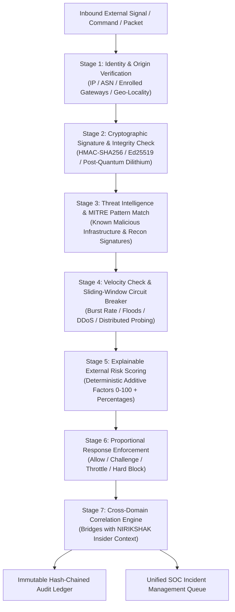
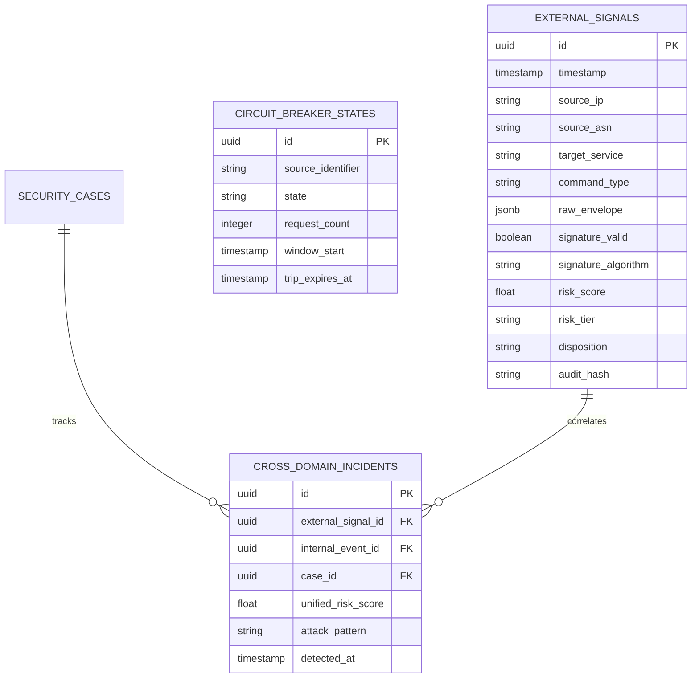

# PRAHARAK (प्रहारक) Architecture & Technical Specification
## The External Threat & Perimeter Risk Twin of NIRIKSHAK

> **PRAHARAK**: Predictive Reconnaissance, Anti-spoofing, and Hardened Access Risk Assessment Knowledgebase  
> **Classification**: ARCHITECTURAL SPECIFICATION & SYSTEM DESIGN  
> **Status**: APPROVED EXTENSION DESIGN  
> **Complementary System**: NIRIKSHAK (Contextual Insider-Risk Decision Support System)

---

## 1. System Philosophy: The Twin Paradigms

NIRIKSHAK and PRAHARAK represent two halves of a single, unified Zero-Trust defense paradigm. Modern sophisticated threat actors do not operate strictly inside or strictly outside; they traverse the perimeter through compromised credentials, supply chain pivots, and command-and-control spoofing.

```text
┌─────────────────────────────────────────────────────────────────────────────┐
│                            NIRIKSHAK NEXUS                                  │
│                 Unified Defense & Correlation Core                          │
├──────────────────────────────────────┬──────────────────────────────────────┤
│         NIRIKSHAK (निरीक्षक)         │          PRAHARAK (प्रहारक)          │
│          The Insider Twin            │          The Outsider Twin           │
├──────────────────────────────────────┼──────────────────────────────────────┤
│ Core Question:                       │ Core Question:                       │
│ "Does this authenticated insider's   │ "Does this external signal, request, │
│ behavior make contextual sense?"     │ or connection have any right to be   │
│                                      │ here, and is it cryptographically    │
│                                      │ untampered and structurally sound?"  │
│                                      │                                      │
│ Focus Areas:                         │ Focus Areas:                         │
│ • Credential misuse & privilege drift│ • Edge perimeter & network intrusion │
│ • Off-hours repository access        │ • Cryptographic command spoofing     │
│ • Volume exfiltration anomalies      │ • Reconnaissance & scan patterns     │
│ • Behavioral baselines & deviations  │ • Mass-attack floods & surges        │
│ • Human-in-the-loop triage           │ • Proportional automated containment │
└──────────────────────────────────────┴──────────────────────────────────────┘
                                  │
                                  ▼
           CROSS-DOMAIN CORRELATION ENGINE (THE NEXUS)
   Fuses external probes + internal anomalies into unified kill-chains
```

### The Operational Axiom of PRAHARAK
$$\text{External Perimeter Access} \neq \text{Authorized Command Execution}$$

* Perimeter traversal and network connectivity grant **zero implicit execution rights**.
* Every external message, telemetry packet, or command must be cryptographically validated before deserialization, parsing, or subsystem handoff.
* Automated circuit breakers protect human operators by containing surges in real time, while preserving all evidence for post-incident forensic audit.

---

## 2. Seven-Stage Ingress & Analysis Pipeline

Every inbound external signal, API request, hardware telemetry beacon, or tactical control command traverses a strictly ordered 7-stage analytical pipeline:



---

## 3. Mathematical Risk Formulation

Mirroring NIRIKSHAK's explainable deterministic scoring framework, PRAHARAK computes an external threat score $\text{Risk}_{\text{Outsider}}(E_{\text{ext}}) \in [0.0, 100.0]$:

$$\text{Risk}_{\text{Outsider}}(E_{\text{ext}}) = \sum_{j \in \mathcal{F}_{\text{ext}}} w_j \cdot S_j(E_{\text{ext}})$$

Where:
$$\mathcal{F}_{\text{ext}} = \{\text{Origin}, \text{Integrity}, \text{Recon}, \text{Velocity}, \text{Intel}\}$$
$$\sum_{j \in \mathcal{F}_{\text{ext}}} w_j = 1.0$$

### Sub-Score Matrix & Weights

| Factor ($j$) | Default Weight ($w_j$) | Evaluated Signal & Heuristics |
| :--- | :---: | :--- |
| **Origin Trust ($S_{\text{Origin}}$)** | `0.20` | BGP ASN reputation, commercial VPN/Tor exit status, known edge gateway whitelist match. |
| **Cryptographic Integrity ($S_{\text{Integrity}}$)** | `0.30` | Valid digital signature (Ed25519 / PQC Dilithium), HMAC timestamp freshness ($\Delta t \le 120\text{s}$), non-replay nonce uniqueness. |
| **Reconnaissance Pattern ($S_{\text{Recon}}$)** | `0.20` | Port scanning, URI path fuzzer signatures, parameter tampering, MITRE ATT&CK tactic matching. |
| **Velocity & Surge ($S_{\text{Velocity}}$)** | `0.15` | Request rate relative to sliding 10s and 60s windows, distributed burst cardinality. |
| **Threat Intelligence ($S_{\text{Intel}}$)** | `0.15` | IOC matches from dynamic blacklist feeds, active threat actor infrastructure indicators. |

---

## 4. Standout Features Breakdown

### 4.1. Feature 1: Cryptographic Command & Signal Spoofing Detection
* **Problem**: Traditional firewalls and Web Application Firewalls (WAFs) only inspect network layers (IP, TLS certificate, HTTP headers). If an adversary spoofs a source address or hijacks a routing path, traditional systems accept the command.
* **PRAHARAK Mechanism**:
  1. Every command payload $M$ carries a cryptographic envelope:
     $$\text{Envelope} = \{M, \, \text{timestamp } t, \, \text{nonce } \eta, \, \text{KeyId } k, \, \sigma = \text{Sign}_{sk}(M \parallel t \parallel \eta)\}$$
  2. The pipeline enforces **zero trust deserialization**: the message body is not parsed by downstream handlers until $\text{Verify}_{pk}(\sigma, M \parallel t \parallel \eta) == \text{True}$.
  3. Replay prevention: Nonces are checked in a fast-lookup Bloom filter / Redis cache for a rolling 15-minute window; expired timestamps ($|t - t_{\text{curr}}| > \Delta t_{\text{max}}$) are immediately dropped.
  4. If verification fails: $\mathcal{S}_{\text{Integrity}} = 100.0$, generating an immediate `SPOOFED_COMMAND_ATTEMPT` critical alert and isolating the channel.

### 4.2. Feature 2: Sliding-Window Mass-Attack Detection & Automated Circuit Breaker
* **Problem**: DDoS and command-injection floods overwhelm SOC analysts with alerts, causing alert fatigue while damaging infrastructure.
* **PRAHARAK Mechanism**:
  * Employs a multi-tier **Graduated Token-Bucket Circuit Breaker**:
    * Window 1: Fast window (10 seconds, threshold 50 req/src).
    * Window 2: Sustained window (60 seconds, threshold 200 req/src).
    * Window 3: Cluster window (Distributed subnet-wide surge).
  * **Circuit Breaker State Machine**:
    * `CLOSED` (Normal): Traffic flows through full inspection pipeline.
    * `HALF-OPEN` (Throttle): Traffic exceeds warning threshold; rate is throttled by 80%, proof-of-work challenge issued.
    * `OPEN` (Tripped): Exceeds hard limit; connection dropped at kernel/socket boundary (eBPF/IP table level), 15-minute automated quarantine enforced.
  * **Analyst Shielding**: The flood is aggregated into a single `FLOOD_SURGE_EVENT` case rather than thousands of individual noise alerts.

### 4.3. Feature 3: Cross-Domain Correlation with NIRIKSHAK (The Core Differentiator)
* **Problem**: External attacks and insider breaches are analyzed in separate silos. When an external actor conducts reconnaissance and subsequently logs in with a compromised credential, the external IDS logs a port scan and the internal PAM logs a valid login. Both seem benign or low priority on their own.
* **PRAHARAK + NIRIKSHAK Fusion**:
  $$\text{Unified Risk} = \min\left(100, \, \max(\text{Risk}_{\text{ext}}, \text{Risk}_{\text{int}}) \cdot \Phi_{\text{cross-domain}}\right)$$
  Where the cross-domain multiplier $\Phi_{\text{cross-domain}}$ is computed based on:
  1. **Temporal Proximity**: $\Delta t = |t_{\text{ext}} - t_{\text{int}}| \le 30\text{ minutes}$.
  2. **Identity Linkage**: The external scan targeted the same departmental subnet or service that user $U_i$ authenticated into.
  3. **Credential Deviation**: $U_i$'s session originates from an unfamiliar device or non-baseline location.
  
  **Outcome**: Instantly triggers a priority CRITICAL case:
  > `[CRITICAL] INCIDENT-HYBRID-004: Coordinated External Reconnaissance & Stolen Credential Exfiltration Kill-Chain.`

### 4.4. Feature 4: Quantum-Resistant Hybrid Signatures (PQC)
* In alignment with long-term sovereign defense readiness, PRAHARAK implements a dual-mode hybrid signature scheme:
  * **Classical Mode**: Ed25519 (256-bit elliptic curve) + HMAC-SHA256.
  * **Post-Quantum Mode**: NIST FIPS 204 ML-DSA (Module-Lattice-Based Digital Signature Algorithm / Dilithium-3) and NIST FIPS 203 ML-KEM (Kyber-768).
* Guarantees that intercepted tactical communications cannot be forged or cracked by future quantum adversaries employing Shor's algorithm.

### 4.5. Feature 5: Tamper-Proof Cryptographic Audit Trail
* Every external event, signature check, circuit trip, and containment action is written to an append-only, SHA-256 hash-chained audit ledger:
  $$H_k = \text{SHA256}(H_{k-1} \parallel \text{Timestamp}_k \parallel \text{EventId}_k \parallel \text{PayloadHash}_k \parallel \text{Disposition}_k)$$
* Makes the audit trail mathematically tamper-evident: any retroactive modification breaks the hash chain, enabling court-admissible forensic verification.

---

## 5. Proportional External Response Matrix

| Risk Score | Tier | Automated Response | Human Cadence |
| :---: | :--- | :--- | :--- |
| **0 – 30** | **LOW** | **ALLOW**: Log event and baseline source behavioral patterns. | No analyst action needed; passive metrics view. |
| **31 – 60** | **MODERATE** | **CHALLENGE**: Require cryptographic re-handshake or proof-of-work; step-up verification. | Aggregated in daily SOC external deviation trends. |
| **61 – 80** | **HIGH** | **THROTTLE & QUARANTINE**: Restrict bandwidth, apply 80% rate limit, queue connection for inspection. | Security Case automatically created; 15-min SLA. |
| **81 – 100**| **CRITICAL** | **BLOCK & CIRCUIT TRIP**: Instant drop at perimeter edge; trip circuit breaker; dispatch high-priority alert. | Immediate command dispatch; simultaneous cross-check of all active sessions. |

---

## 6. MITRE ATT&CK Mapping for PRAHARAK

PRAHARAK maps all detected signals to standardized MITRE ATT&CK tactics:

| MITRE ID | Tactic | Technique | PRAHARAK Detection Mechanism |
| :--- | :--- | :--- | :--- |
| **T1595** | Reconnaissance | Active Scanning | Network probe detection, high TCP SYN frequency to closed ports. |
| **T1190** | Initial Access | Exploit Public-Facing Application | Payload pattern matching, unexpected URI parameter structures. |
| **T1110** | Credential Access | Brute Force / Password Spraying | Multi-account login attempts from shared external subnet. |
| **T1565.002**| Impact | Transmitted Data Manipulation (Spoofing) | Cryptographic signature verification failure, nonce replay. |
| **T1499** | Impact | Endpoint Denial of Service | Token-bucket circuit breaker trip on sliding-window request surge. |
| **T1071** | Command & Control| Application Layer Protocol | Anomaly in external C2 beacon intervals and message structure. |

---

## 7. Unified Database Schema Extension

PRAHARAK integrates cleanly into NIRIKSHAK’s relational model via PostgreSQL:



---

## 8. The Defense & Security Officer Pitch

> *"Most cyber defense failures don't happen because an organization lacked a firewall, and they don't happen because they lacked access permissions. They happen because real-world attacks are hybrid.*
>
> *An adversary scans from the outside, finds a path, steals a credential, and immediately walks past the perimeter. From that second forward, traditional perimeter tools say 'they left,' and internal tools say 'they belong here.'*
>
> *PRAHARAK and NIRIKSHAK break this operational blind spot. By deploying twin engines over a shared correlation core, the instant external reconnaissance occurs at the edge, internal telemetry is primed. If that identity is used moments later in an anomalous manner, the system doesn't generate two separate, low-priority alerts—it synthesizes a single, unified CRITICAL incident, trips the perimeter circuit breaker, and presents an explainable, court-admissible audit trail to the commander."*
