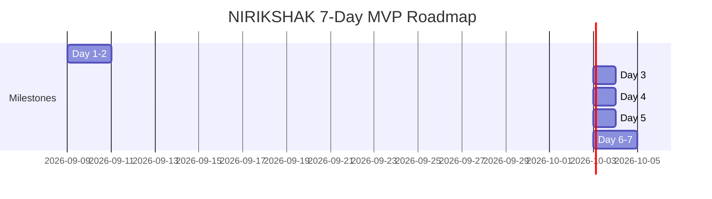

# NIRIKSHAK Implementation Roadmap (Trimmed 7-Day MVP)

> **NIRIKSHAK**: Contextual, Human-Supervised, Explainable Risk and Access Knowledge Framework  
> **Timeline**: ~7 Days (Solo Demo Build)  
> **Primary Goal**: Flawless reliability and an impressive, narratable live demonstration.  
> **Status**: APPROVED REVISED MVP ROADMAP

---

## 1. 7-Day Milestone Overview

---

## 2. Milestone Deliverables & Exit Criteria

### Milestone 1: Foundation & Core Data Model (Days 1 – 2)
* **Scope**: Stand up the core 3-tier container stack and seed the PostgreSQL database.
* **Deliverables**:
  * Clean `docker-compose.yml` (`db`, `backend`, `frontend`).
  * FastAPI server with `/api/v1/health` verifying PostgreSQL connection.
  * Next.js 14 frontend skeleton connecting to backend.
  * SQLAlchemy 2.0 async models for: `users`, `roles`, `devices`, `resources`, `resource_classifications`, `access_events`, `behavior_baselines`, `risk_scores`, `risk_factors`, `security_cases`, `audit_logs`.
  * Automatic schema initialization via `Base.metadata.create_all()` on FastAPI startup.
  * Seed data: `USER-001` through `USER-010`, 5 synthetic repositories, seeded analyst credentials (`analyst_sarah` / `analyst123`).
* **Exit Criteria**: `docker compose up -d` starts cleanly; backend auto-provisions tables and seeds; backend and frontend report healthy.

---

### Milestone 2: Deterministic Risk & Explanation Engine (Day 3)
* **Scope**: Implement the rules-based scoring module across the 4 key dimensions.
* **Deliverables**:
  * `backend/app/engines/risk_engine.py` evaluating:
    * Identity signal (MFA status, account status).
    * Device trust signal (known hardware, registration).
    * Sensitivity signal (data tier + cross-department penalty).
    * Behavior signal (time deviation, volume Z-score, resource novelty).
  * Weighted normalizer generating composite score $[0, 100]$ and assigning tiers (`LOW`, `MODERATE`, `HIGH`, `CRITICAL`).
  * `backend/app/engines/explanation_engine.py` decomposing score into factor contributions.
* **Exit Criteria**: Unit tests confirm deterministic scores match expected values for normal vs. anomalous inputs.

---

### Milestone 3: Telemetry Ingestion & On-Demand Scenarios (Day 4)
* **Scope**: Event ingestion endpoint and pre-scripted demo scenario triggers.
* **Deliverables**:
  * `POST /api/v1/events` endpoint validating payload and triggering real-time risk evaluation.
  * CLI & API scenario runner (`simulator/event_generator.py`):
    * `scenario-1`: Normal engineering daily read (Low risk).
    * `scenario-2`: Off-hours access to critical repository (High risk).
    * `scenario-3`: Bulk exfiltration from unmanaged device (Critical risk).
* **Exit Criteria**: Triggering a scenario successfully persists the event, computes risk, and stores explanation in PostgreSQL.

---

### Milestone 4: Case Management & Human Audit Trail (Day 5)
* **Scope**: Case generation and the human-in-the-loop review action.
* **Deliverables**:
  * Automatic `SecurityCase` creation for events with risk score $\ge 61$ (`HIGH` or `CRITICAL`).
  * `POST /api/v1/cases/{id}/review` endpoint supporting two actions: `DISMISS` and `ESCALATE`.
  * Mandatory justification string required for review.
  * Atomic insertion of immutable audit record into `audit_logs`.
* **Exit Criteria**: Case can be dismissed or escalated; audit log reflects analyst ID, timestamp, decision, and justification.

---

### Milestone 5: Modern SOC Dashboard UI & Live Demo Polish (Days 6 – 7)
* **Scope**: Build the graphical analyst interface and rehearse the demo flow.
* **Deliverables**:
  * Event stream table with live polling and risk badge chips (`LOW`, `MODERATE`, `HIGH`, `CRITICAL`).
  * Event Inspector drawer: risk gauge, factor breakdown cards with point contributions and plain-language reasons.
  * Case Triage Panel: One-click "Dismiss" / "Escalate" modal with justification form.
  * Demo Control Panel: Buttons to trigger Demo Scenarios directly from the UI.
  * Seeded login modal (`analyst_sarah`).
* **Exit Criteria**: Complete end-to-end walkthrough runs seamlessly from the browser without errors.
