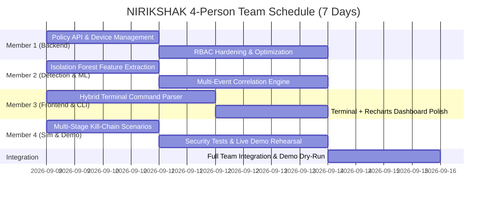

# NIRIKSHAK — 4-Person Team Distribution & Implementation Strategy

> **Project**: NIRIKSHAK (*निरीक्षक* — Contextual, Human-Supervised, Explainable Risk and Access Knowledge Framework)  
> **Team Size**: 4 Engineers  
> **Timeline**: ~7 Days to Final Demo  
> **Current Baseline**: Working 3-tier containerized prototype (PostgreSQL + FastAPI + Next.js), 4-signal deterministic engine, case triage, audit trail, and scenario triggers already verified!

---

## 1. Role-Based Work Breakdown Structure (WBS)

With 4 engineers, the project can execute the full vision of the NIRIKSHAK specification in parallel without stepping on each other's codebases:

```text
┌──────────────────────────────────────────────────────────────────────────────┐
│                              TEAM OF 4 DIVISION                              │
├──────────────────────┬──────────────────────┬────────────────────────────────┤
│ ROLE & OWNER         │ CORE FOCUS           │ PRIMARY REPOSITORY PATHS       │
├──────────────────────┼──────────────────────┼────────────────────────────────┤
│ MEMBER 1:            │ Core Backend, DB &   │ • backend/app/api/             │
│ Backend & Data Lead  │ Policy Management    │ • backend/app/models/          │
│                      │                      │ • backend/app/services/        │
├──────────────────────┼──────────────────────┼────────────────────────────────┤
│ MEMBER 2:            │ ML Anomaly & Multi-  │ • backend/app/engines/         │
│ Detection & AI Eng   │ Event Correlation    │ • ml/training/                 │
│                      │                      │ • ml/features/                 │
├──────────────────────┼──────────────────────┼────────────────────────────────┤
│ MEMBER 3:            │ SOC Dashboard &      │ • frontend/app/                │
│ Frontend & CLI Lead  │ Hybrid Terminal UI   │ • frontend/components/         │
│                      │                      │ • frontend/lib/                │
├──────────────────────┼──────────────────────┼────────────────────────────────┤
│ MEMBER 4:            │ Advanced Simulator,  │ • simulator/                   │
│ DevOps & Security QA │ Testing & Demo Flow  │ • tests/security/              │
│                      │                      │ • docker-compose.yml           │
└──────────────────────┴──────────────────────┴────────────────────────────────┘
```

---

## 2. Detailed Member Responsibilities & Deliverables

### Member 1: Backend & Data Architect
* **Primary Scope**: Core API routes, RBAC, policy configuration, database performance.
* **Key Tasks**:
  1. **Policy Configuration API**: Implement `GET /api/v1/policies` and `PUT /api/v1/policies/{key}` allowing dynamic adjustment of risk weights ($w_I, w_D, w_S, w_B, w_A, w_C$) directly from the database instead of static env vars.
  2. **Device & User Management Endpoints**: `GET /api/v1/users/{id}`, `PATCH /api/v1/devices/{id}/trust` (marking a device as `REVOKED` or `TRUSTED`).
  3. **Data Protection & Sanitization**: Ensure RFC 7807 error consistency, sanitize API responses, and enforce RBAC dependency checks.

### Member 2: Detection, Correlation & ML Engineer
* **Primary Scope**: Bring back the Machine Learning Anomaly Signal & Multi-Event Correlation.
* **Key Tasks**:
  1. **Isolation Forest Model (`ml/`)**:
     - Feature pipeline converting access events into 6D numerical vectors (time deviation, volume deviation, device familiarity, resource sensitivity).
     - Pre-trained Isolation Forest artifact (`ml/models/isolation_forest_v1.joblib`).
     - Integrate `AnomalyEngine` into `backend/app/engines/anomaly_engine.py` contributing a 15% additive signal.
  2. **Multi-Event Correlation Engine (`backend/app/engines/correlation_engine.py`)**:
     - Temporal sequence detection (sliding window: 5m, 15m, 30m).
     - Cluster related events from the same user/session into a single `SecurityCase` with an amplification multiplier for escalating attack kill-chains.

### Member 3: Frontend & Hybrid Command Console Engineer
* **Primary Scope**: Elevate the UI into a hybrid SOC Dashboard + Integrated Analyst Command Console.
* **Key Tasks**:
  1. **Hybrid Command Console (`frontend/components/terminal/`)**:
     - Implement the keyboard-driven terminal console at the bottom of the dashboard.
     - Lexer & AST parser strictly enforcing the allowlist (`help`, `clear`, `status`, `events`, `cases`, `investigate <id>`, `explain <id>`, `risk <id>`).
     - Tab autocomplete, up/down command history, and structured ASCII table rendering.
     - Connect terminal commands directly to the existing Axios API client.
  2. **Recharts Visualizations**:
     - Longitudinal risk trends area chart.
     - 4-factor radar chart or bar gauge in the event inspector.

### Member 4: Simulator, DevOps & Demo Choreography Lead
* **Primary Scope**: Complex attack scenario scripts, security tests, and the live demo rehearsal.
* **Key Tasks**:
  1. **Multi-Stage Attack Simulator (`simulator/`)**:
     - Create realistic multi-step attack scenarios:
       - *Stage 1*: Off-hours credential login from new IP.
       - *Stage 2*: Directory reconnaissance across repositories.
       - *Stage 3*: Privilege traversal to CRITICAL repository.
       - *Stage 4*: High-volume bulk exfiltration attempt.
  2. **Automated Security Verification Suite (`tests/security/`)**:
     - Tests for SQL injection, terminal command injection breakout attempts, token tampering, and role escalation.
  3. **Demo Script & Presentation Deck**:
     - Write the 5-minute live demo script showing the contrast between unexplainable black-box alerts vs. NIRIKSHAK's transparent, human-reviewed decision support.

---

## 3. Recommended 7-Day Team Execution Schedule



---

## 4. Git Collaboration Rules for the 4 Members

1. **Branch Naming Convention**:
   - `feat/backend-policies` (Member 1)
   - `feat/ml-correlation` (Member 2)
   - `feat/hybrid-terminal` (Member 3)
   - `feat/attack-simulator` (Member 4)
2. **Contract-First Development**:
   - All REST schemas in [docs/API_CONTRACT.md](file:///Users/kanishksingh/Downloads/hack2ignite/NIRIKSHAK/docs/API_CONTRACT.md) are the single source of truth. Do not modify endpoint signatures without team consensus.
3. **Database Rules**:
   - Since `Base.metadata.create_all()` is used, any new model or column in `backend/app/models/` is auto-created on restart.
