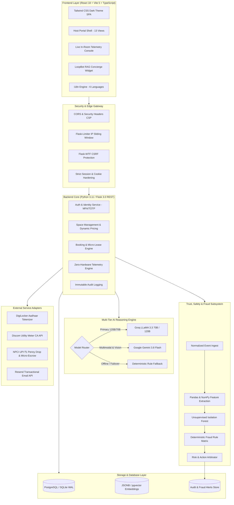
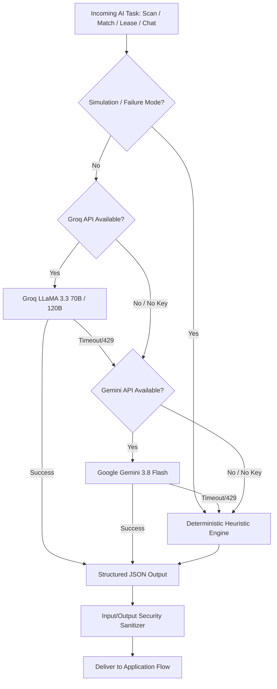
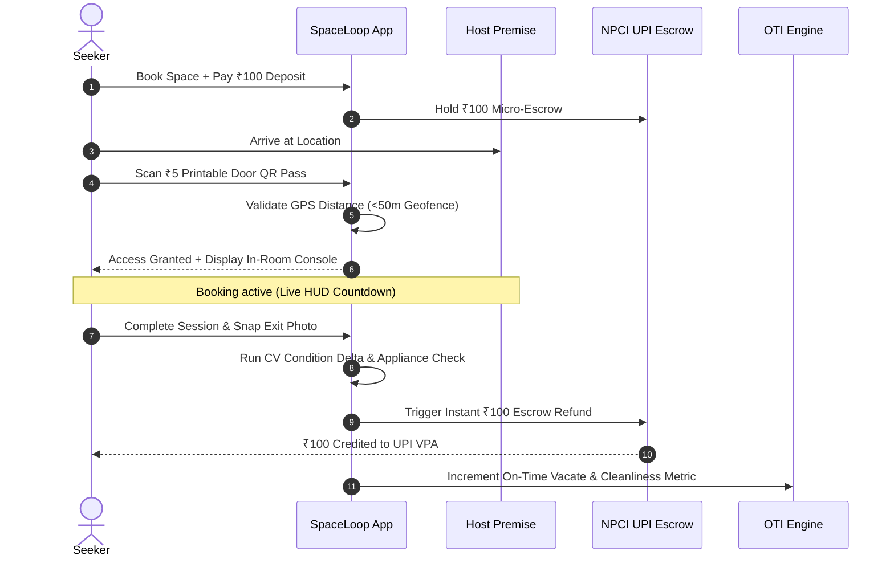
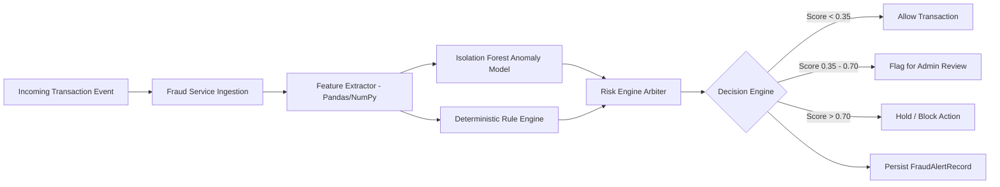

<div align="center">

# 🌀 SpaceLoop

### **AI-Native Peer-to-Peer Physical Space Marketplace & Zero-Hardware Telemetry OS**

[](https://spaceloop.onrender.com)
[](https://spaceloop.vercel.app)
[](https://www.python.org/)
[](https://react.dev/)
[](https://tailwindcss.com/)
[](LICENSE)

<p align="center">
  <a href="#-the-problem">Problem</a> •
  <a href="#-core-solution--features">Key Features</a> •
  <a href="#-system-architecture">Architecture</a> •
  <a href="#-multi-tier-ai-engine">AI Subsystem</a> •
  <a href="#-zero-hardware-india-stack">India Stack & Telemetry</a> •
  <a href="#-trust-safety--fraud-detection">Trust & Fraud</a> •
  <a href="#-host-portal-suite">Host Portal</a> •
  <a href="#-api-reference">APIs</a> •
  <a href="#-quick-start">Quick Start</a> •
  <a href="#-team--credits">Team</a>
</p>

</div>

---

## ⚡ Executive Summary

**SpaceLoop** transforms unused urban real estate into flexible, on-demand temporary spaces. Across modern cities, millions of square feet—garages, sound booths, off-peak retail storefronts, basements, conference rooms, photo studios, and driveways—sit vacant. Meanwhile, creators, students, freelancers, and micro-entrepreneurs face exorbitant commercial leases and rigid multi-year contracts.

SpaceLoop solves this with an **AI-driven marketplace operating system** paired with a **Zero-Hardware Physical Telemetry Stack**:

```mermaid
flowchart LR
    Host([Host Snap & Notes]) --> AI_Scan[Multimodal AI Space Inspector]
    AI_Scan --> Listing[Verified Active Listing]
    Seeker([Seeker Natural Language Query]) --> AI_Match[Hybrid Intent Matchmaker]
    Listing --> AI_Match
    AI_Match --> Lease[Sec 52 Micro-Lease Synthesizer]
    Lease --> Hold[₹100 UPI Micro-Escrow Hold]
    Hold --> CheckIn[GPS Radar + ₹5 Printable Door QR Pass]
    CheckIn --> Session[Live In-Room Session Console]
    Session --> CheckOut[CV Room Condition & Appliance Delta]
    CheckOut --> Refund[Instant UPI Escrow Release + OTI Update]

    style Host fill:#1e1b4b,stroke:#818cf8,stroke-width:2px,color:#ffffff
    style Seeker fill:#1e1b4b,stroke:#818cf8,stroke-width:2px,color:#ffffff
    style AI_Scan fill:#312e81,stroke:#a5b4fc,stroke-width:2px,color:#ffffff
    style AI_Match fill:#312e81,stroke:#a5b4fc,stroke-width:2px,color:#ffffff
    style Lease fill:#064e3b,stroke:#34d399,stroke-width:2px,color:#ffffff
    style Hold fill:#701a75,stroke:#f472b6,stroke-width:2px,color:#ffffff
    style CheckIn fill:#0f172a,stroke:#38bdf8,stroke-width:2px,color:#ffffff
    style Session fill:#0f172a,stroke:#38bdf8,stroke-width:2px,color:#ffffff
    style CheckOut fill:#831843,stroke:#fb7185,stroke-width:2px,color:#ffffff
    style Refund fill:#064e3b,stroke:#34d399,stroke-width:2px,color:#ffffff
```



---

## 💡 The Problem

| Urban Inefficiency | The Impact | The SpaceLoop Fix |
|---|---|---|
| **Underutilized Urban Dead Space** | Garages, study nooks, and boutique spaces sit empty >65% of the day while property taxes accumulate. | Liquid, hourly/daily micro-rentals with dynamic earnings pricing. |
| **Tenancy Law & Squatter Paranoia** | Property owners fear long-term lease disputes and adverse possession claims under traditional tenancy acts. | **Section 52 Indian Easements Act (1882)** revocable licenses with zero tenancy rights created. |
| **Expensive IoT Smart-Lock Hardware** | Smart locks cost ₹15,000–₹40,000+, require battery changes, and need stable Wi-Fi. | **Zero-Hardware Telemetry**: Printable ₹5 cryptographic door QR passes, smartphone GPS radar (<50m), and caretaker PINs. |
| **High Security Deposits & Payment Friction** | Seekers cannot lock up ₹5,000–₹20,000 for a 3-hour study session. | **₹100 Automated UPI Micro-Escrow** with instant programmatic refunds upon Computer Vision room exit verification. |
| **Unverified Bad Actors** | High fraud risk in peer-to-peer property sharing. | **Dual-Sided DPDP Act (2023) Verification**: DigiLocker masked Aadhaar, `.ac.in` student SSO, and State Discom electricity meter CA checks. |

---

## 🚀 Core Solution & Features

### 1. 🤖 Multimodal AI Space Inspector
Hosts upload a photo and bullet points. SpaceLoop's vision-LLM pipeline automatically extracts:
- **Spatial Geometry & Sqft Estimation:** Usable square footage, capacity limits, and layout.
- **Acoustic Background Profile:** Noise decibel ratings (e.g., `<36 dB Studio Quiet`).
- **Natural & Ambient Lighting:** Lux and daylight rating for creators and photographers.
- **Power & Utility Mapping:** Identifies grounded outlets, dedicated 20A circuits, Wi-Fi 6, and EV charging points.
- **Copywriting & SEO:** Auto-generates high-converting listing titles, tags, and safety advisories.

### 2. 🎯 Natural Language Intent Matchmaker & Vector Search
Seekers search with conversational, multi-variable requests:
> *"Need a soundproof room near Hauz Khas under ₹300/hr for 4 people to record a podcast with high-speed Wi-Fi and power outlets on Sunday afternoon"*

- **Multi-Constraint Parser:** Extracts budget thresholds, geographic bounding boxes, acoustic limits, and hardware dependencies.
- **Deterministic Match Scoring:** Combines Haversine distance, budget-fit ratio, tag overlap, and compatibility heuristics to output a **0–100% Match Score** with explainable *"Why this matches"* rationales.

### 3. 📜 Plain-English AI Micro-Lease Synthesizer
Eliminates legal hesitation by generating an instantaneous, customized **Temporary Space Use License Agreement** on every booking:
- **Section 52 of the Indian Easements Act, 1882 Compliant:** Formulated strictly as a revocable license rather than a leasehold, completely extinguishing tenancy claims.
- **Context-Tailored House Rules:** Dynamically injects quiet curfews, maximum guest caps, electrical load limits, and checkout checklists.

### 4. 🚪 Zero-Hardware Access & Live Session Console
Seekers unlock physical spaces with zero hardware installed by the host:
- **Cryptographic Door QR Pass:** Printable ₹5 QR code carrying a cryptographically signed `room_qr_token`.
- **GPS Radar Verification:** Client-side GPS geofencing validates device presence within **<50 meters** of the property coordinates.
- **4-Digit Caretaker Fallback PIN:** Dynamic PIN for human-attended handshakes.
- **Live In-Room HUD:** Real-time countdown timer, Wi-Fi credentials, host emergency contact, and one-tap extension.

### 5. 👁️ Computer Vision Room Condition Delta & Appliance Check
At checkout, seekers capture an exit photo:
- **Condition Match Score:** Compares check-in vs check-out room geometry to ensure furniture, walls, and flooring remain unaltered.
- **Electrical Shutdown Verification:** Detects glowing indicators, running fans, and illuminated lights to enforce energy conservation.
- **Programmatic Escrow Refund:** Automatically releases the ₹100 UPI hold within seconds if condition match is verified.

### 6. 🏆 Objective Telemetry Index (OTI)
Replaces subjective, biased star reviews with deterministic telemetry metrics:

$$\text{OTI} = (0.35 \times \text{Punctuality}) + (0.35 \times \text{Cleanliness CV}) + (0.20 \times \text{Identity Verification}) + (0.10 \times \text{Dispute Record})$$

- **Punctuality (35%):** Measured by GPS timestamped vacating of the premises.
- **Cleanliness (35%):** Computer Vision room delta and appliance power-off score.
- **Identity Trust (20%):** DigiLocker Aadhaar, student university SSO, or Discom CA validation.
- **Dispute History (10%):** Record of clean deposit releases without host damages claims.

### 7. 🌐 Full Multilingual Experience (i18n)
Full platform localization across 6 regional Indian languages with automatic browser detection and seamless switching:
- **English** (`en`)
- **हिन्दी (Hindi)** (`hi`)
- **मराठी (Marathi)** (`mr`)
- **गढ़वाली (Garhwali)** (`gar`)
- **कुमाऊँनी (Kumaoni)** (`kfy`)
- **जौनसारी (Jaunsari)** (`jns`)

---

## 🏗️ System Architecture



---

## 🧠 Multi-Tier AI Engine

SpaceLoop follows the **AI Should Assist, Not Control** architectural principle. Critical business operations (pricing bounds, booking validations, physical access, escrow disbursements) remain 100% deterministic and functional even during total external AI outages.



### Capabilities & Responsibilities

| Subsystem | Primary Model | Fallback Model | Deterministic Heuristic Fallback |
|---|---|---|---|
| **Space Inspection & Tagging** | `gemini-3.8-flash` (Multimodal Vision) | `llama-3.3-70b-versatile` | Keyword extraction, rule-based square footage estimator & default safety checks |
| **Natural Language Intent Match** | `openai/gpt-oss-120b` (Groq) | `gemini-1.5-flash` | Haversine distance, budget filter, tag overlap scoring |
| **Micro-Lease Synthesizer** | `llama-3.3-70b-versatile` (Groq) | `gemini-3.8-flash` | Section 52 Easements Act statutory template with slot interpolation |
| **LoopBot RAG Concierge** | `openai/gpt-oss-120b` (Groq) | `gemini-3.8-flash` | Indexed FAQ knowledge base & space catalog semantic search |
| **Checkout Condition Delta** | `gemini-3.8-flash` (Vision) | OpenCV Delta / Heuristic | Structural feature comparison, lighting threshold validator |

---

## 🇮🇳 Zero-Hardware India Stack

SpaceLoop is engineered from the ground up for the Indian urban ecosystem, utilizing legal and digital infrastructure without requiring expensive imported IoT smart devices:



### 1. Section 52, Indian Easements Act (1882)
Every booking issues a non-exclusive, revocable license agreement. This guarantees:
- **Zero Tenancy Creation:** Seekers possess no tenant status or rights of exclusive possession.
- **Right of Re-Entry:** Hosts retain unfettered dominion and right of inspection at all times.
- **Immediate Eviction:** Expiration of the booking window automatically terminates the license.

### 2. DPDP Act 2023 Compliant Identity Engine
- **DigiLocker Aadhaar Tokenization:** Aadhaar numbers are never stored in plaintext. SpaceLoop extracts a one-way cryptographic SHA-256 hash and renders masked representations (`XXXX-XXXX-4821`).
- **Student Verification:** Direct institutional validation for `.ac.in` and `.edu.in` academic domains.
- **Discom Utility Verification:** Direct cross-referencing of Consumer Account (CA) electricity meter numbers (BESCOM, TPDDL, Tata Power, Adani Electricity) to prove property ownership.
- **NPCI ₹1 UPI Penny Drop:** Instant verification of host bank accounts and VPAs against beneficiary names before enabling payout disbursements.

---

## 🛡️ Trust, Safety & Fraud Detection

SpaceLoop features a modular, enterprise-grade **Fraud & Trust Engine** running in real-time alongside transactional flows:



### Comprehensive Security Controls

| Category | Control Implementation | Standard Reference |
|---|---|---|
| **Authentication** | PBKDF2:SHA256 (600k iterations) / Scrypt password hashing, session regeneration upon login, RFC 6238 TOTP Multi-Factor Authentication with encrypted secrets and single-use recovery codes. | OWASP ASVS V2 |
| **Authorization & IDOR** | Strict resource ownership checks (`SPACE_UPDATE`, `BOOKING_CHECKIN`, `BOOKING_CANCEL`). Prevents horizontal privilege escalation. | OWASP Top 10 A01:2021 |
| **Transport & Session** | `HttpOnly`, `SameSite=Lax`, `Secure` cookies, global `Flask-WTF` CSRF protection, strict Content-Security-Policy (CSP). | OWASP Top 10 A05:2021 |
| **Rate Limiting** | Sliding window rate limits via `Flask-Limiter` (Login: 5/min, Register: 3/min, KYC: 10/min, AI Scan: 15/min). | OWASP Top 10 A04:2021 |
| **Auditability** | Immutable append-only audit trail (`audit_logs`, `access_logs`, `fraud_events`, `fraud_alerts`, `email_logs`). | SOC 2 / ISO 27001 |

---

## 💼 Host Portal Suite

The SpaceLoop Host Portal (`/host/*`) provides a dedicated 13-view management suite for space operators:

```
host/
├── Overview           → High-level revenue, occupancy stats, and immediate alerts
├── My Spaces          → Space portfolio management, drafts, and pricing toggles
├── Space Detail       → Deep inspection, photos, AI tags, and geometry specs
├── Create Space       → AI-assisted listing wizard with auto-amenity extraction
├── Bookings           → Real-time booking requests, check-in statuses, and history
├── Booking Detail     → Micro-lease agreements, guest telemetry, and dispute triage
├── Calendar           → Multi-space scheduling grid with buffer time controls
├── Live Sessions      → Real-time active in-room telemetry HUD & occupant radar
├── Verification       → Discom CA verification & UPI penny drop onboarding
├── Access & Security  → Printable door QR pass generator & dynamic caretaker PINs
├── Condition & Escrow → Computer Vision check-in/check-out delta viewer & deposit releases
├── Analytics          → Hourly demand heatmaps, OTI trends, and revenue projections
├── Activity Audit     → Immutable audit logging of all host account actions
├── Host Settings      → Payout VPA configuration, instant booking, and notification prefs
└── Notifications      → Real-time drawer alerts for bookings, deposits, and verifications
```

---

## 📡 API Reference

### Core Business APIs (`/api/*`)

| Method | Route | Description | Auth Scope |
|---|---|---|---|
| `GET` | `/api/spaces` | Query active space listings with multi-variable filters | Public |
| `GET` | `/api/spaces/<id>` | Fetch space specifications, amenities, and host trust metrics | Public |
| `POST` | `/api/spaces` | Publish a new space listing | Verified Host |
| `POST` | `/api/spaces/<id>/edit` | Edit space pricing, rules, or details (IDOR protected) | Space Owner |
| `POST` | `/api/spaces/<id>/toggle-status` | Pause or resume space availability | Space Owner |
| `POST` | `/api/spaces/ai-scan` | Multimodal AI vision analysis on space photo & notes | Public |
| `POST` | `/api/spaces/ai-match` | Natural language conversational intent matchmaker | Public |
| `POST` | `/api/bookings` | Create instant booking & synthesize AI Micro-Lease | Verified Seeker |
| `POST` | `/api/booking/<id>/check-in` | GPS radar (<50m) & Door QR access handshake | Booking Seeker |
| `POST` | `/api/booking/<id>/check-out` | Computer Vision exit condition delta & ₹100 refund | Booking Seeker |
| `POST` | `/api/booking/<id>/cancel` | Cancel reservation and release escrow deposit | Seeker / Host |
| `POST` | `/api/calculator/estimate` | Calculate host earnings & dynamic hourly pricing | Public |
| `POST` | `/api/ai/chat` | Query LoopBot RAG conversational concierge | Public |
| `POST` | `/api/verify/student` | Verify student DigiLocker Aadhaar & `.ac.in` domain | Authenticated |
| `POST` | `/api/verify/host` | Verify Discom CA electricity bill & UPI penny drop | Authenticated |

### Identity & Authentication APIs (`/api/v1/auth/*`)

| Method | Route | Description | Auth Scope |
|---|---|---|---|
| `POST` | `/api/v1/auth/register` | Register new account with role validation | Public |
| `POST` | `/api/v1/auth/login` | Authenticate credentials & generate secure session | Public |
| `POST` | `/api/v1/auth/logout` | Terminate session & clear cookies | Authenticated |
| `GET` | `/api/v1/auth/me` | Fetch authenticated user profile & OTI score | Authenticated |
| `POST` | `/api/v1/auth/forgot-password` | Issue secure password reset token via Resend | Public |
| `POST` | `/api/v1/auth/reset-password` | Reset account password with token | Public |
| `POST` | `/api/v1/auth/mfa/setup` | Generate TOTP secret & QR code uri | Authenticated |
| `POST` | `/api/v1/auth/mfa/verify` | Verify TOTP code and enable MFA | Authenticated |

---

## ⚡ Quick Start

### Prerequisites
- **Python:** `3.11` or higher
- **Node.js:** `18.x` or `20.x`
- **npm:** `9.x` or higher

```bash
# 1. Clone the repository
git clone https://github.com/kanishksingh-01/spaceloop.git
cd spaceloop

# 2. Set up Python virtual environment
python -m venv venv
source venv/bin/activate       # Linux/macOS
# Windows: .\venv\Scripts\Activate.ps1

# 3. Install Python backend dependencies
pip install -r requirements.txt

# 4. Configure environment variables
cp .env.example .env

# 5. Seed the database with demo listings and users
python seed_data.py

# 6. Start the Flask Backend Server (Port 5000)
python app.py
```

In a separate terminal, start the React frontend:

```bash
# 7. Install and launch React Vite frontend (Port 3000)
cd frontend
npm install
npm run dev
```

Visit **`http://localhost:3000`** in your browser.

---

## 👥 Pre-Seeded Demo Accounts

All pre-seeded test fixtures use the password: **`password123`**

| Persona | Email | Role | Verification & Badges | Purpose |
|---|---|---|---|---|
| **Host (Delhi)** | `sunita@spaceloop.in` | Host (`owner`) | Discom Verified, UPI Penny Drop, OTI 99.2 | Study rooms and quiet workspace host |
| **Seeker (Student)** | `aarav@iitd.ac.in` | Seeker (`seeker`) | DigiLocker Aadhaar, IIT Delhi `.ac.in` | Student hackathon and study room renter |
| **Host (Dev)** | `dev-host@spaceloop.local` | Host (`owner`) | BESCOM Verified, UPI Verified | Automated test suite host fixture |
| **Seeker (Dev)** | `dev-seeker@spaceloop.local` | Seeker (`seeker`) | Student & Aadhaar Verified | Automated test suite seeker fixture |
| **Administrator** | `dev-admin@spaceloop.local` | Admin (`is_admin=True`) | Super Admin Authority | System governance, fraud triage & disputes |

---

## 🧪 Testing & Quality Assurance

SpaceLoop maintains an end-to-end automated test suite covering all functional, security, and AI subsystems:

```bash
# Run the 14-Point End-to-End Functional Audit Suite
python test_all_features_functional.py

# Run the Pytest Unit & Integration Test Suite
pytest tests/
```

### Verified Test Coverage
- **14/14 End-to-End Functional Subsystems Verified** (Homepage, Spaces API, Space Detail, AI Scan, Natural Language Match, Create Space, Earnings Calculator, LoopBot RAG, Student KYC, Host KYC, Instant Booking + Micro-Lease, GPS Check-In, CV Check-Out & UPI Escrow, HTML Template Views).
- **Authentication & Security Controls:** Password complexity, rate limiting, session regeneration, IDOR barriers, MFA/TOTP validation.
- **Trust & Safety Engine:** Anomaly detection, Isolation Forest scoring, rule triggers, and risk level assignment.

---

## 🚀 Deployment

### 1. Deploy to Render (1-Click Blueprint)

[](https://render.com/deploy?repo=https://github.com/kanishksingh-01/spaceloop)

Configured via [`render.yaml`](render.yaml) with Python 3.11, Gunicorn WSGI (`2 workers, 4 threads`), auto-seeding SQLite WAL / PostgreSQL, and `/api/health` monitoring.

### 2. Deploy to Vercel (Edge Frontend)
Configured via [`vercel.json`](vercel.json) with React 18 single-page application routing and serverless Python API proxying.

### 3. Docker Container Deployment
```bash
# Build multi-stage container
docker build -t spaceloop:latest .

# Run container
docker run -p 5000:5000 --env-file .env spaceloop:latest
```

---

## 👥 Team LOGIC LOOP

Built with ❤️ by **Team LOGIC LOOP** *(GH Raisoni International Skill Tech University, Pune)* for **Hack2Ignite 2026**:

<div align="center">
<table>
  <tr>
    <td align="center" width="25%">
      <br />
      <sub><b>Indrayani Mazumder</b></sub><br />
      <sub>AI/ML & Research</sub>
    </td>
    <td align="center" width="25%">
      <br />
      <sub><b>Kanishk Singh</b></sub><br />
      <sub>Backend & Product Designer</sub>
    </td>
    <td align="center" width="25%">
      <br />
      <sub><b>Zara Quadri</b></sub><br />
      <sub>Frontend & UI-UX Developer</sub>
    </td>
    <td align="center" width="25%">
      <br />
      <sub><b>Aarya Maurya</b></sub><br />
      <sub>System Architect & Security</sub>
    </td>
  </tr>
</table>
</div>

---

## 📄 License

SpaceLoop is licensed under the [MIT License](LICENSE).  
Copyright © 2026 Team LOGIC LOOP. All rights reserved.
